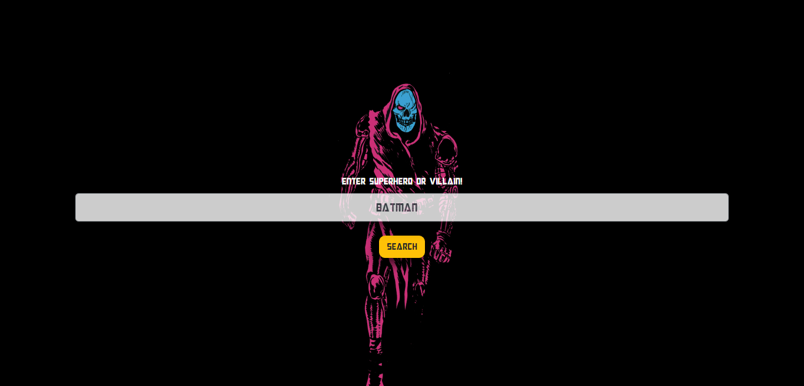
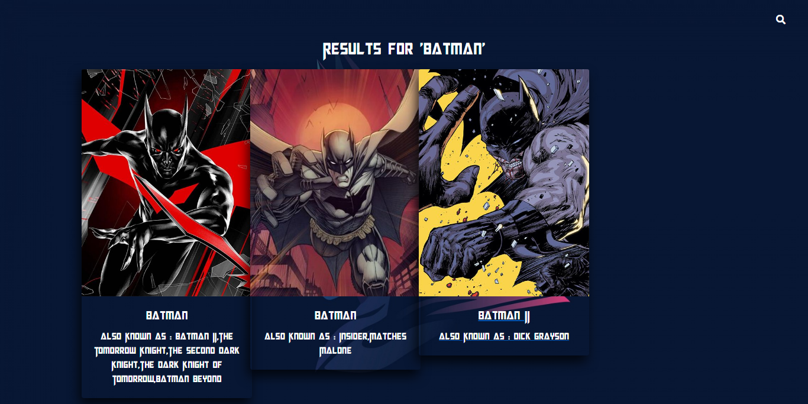
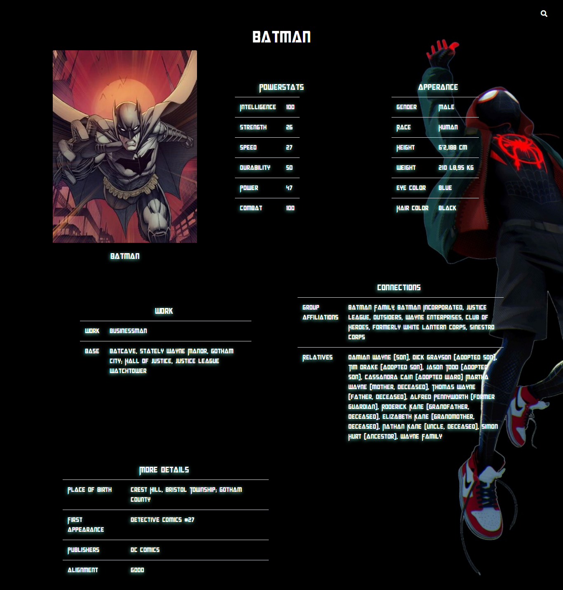

# Superhero App
## Get details about superheroes and villains from both universe!

> This app uses [superhero API](https://superheroapi.com/) to fetch details about character that you search 
> . It has wide range of character details

## Installation

This app uses various other open source project to run properly

- [Node.js](https://nodejs.org)
- [Express](http://expressjs.com/)
- [Bootstrap](https://getbootstrap.com/)
- [jQuery](https://jquery.com/)
- [Font Awesome](https://fontawesome.com/)


## How to run this project?
1. Get access token from [here](https://superheroapi.com/)
1. Save that access token as 'key.txt' in root directory
1. Download all dependencies by entering ``` npm install ``` command in terminal
1. Than enter ```node app.js``` command to start the server. Open http://127.0.0.1:3000 to view the site

## Screenshots

### Home page


### Search Page


## Detail about character


